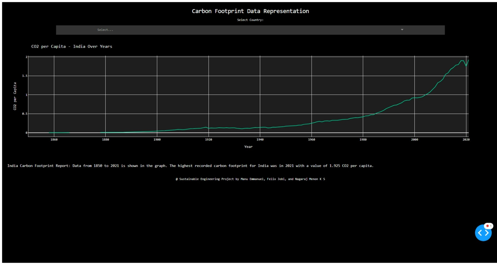

# Carbon Footprint Data Representation and Analysis

This is an interactive web application designed to visualize and analyze carbon footprint data across different countries.
## Usage

Navigate to the hosted [website](https://sustainable-engineering-project-production.up.railway.app/)

### Website Url
```bash
 https://sustainable-engineering-project-production.up.railway.app/
```

## Run Locally

Clone the project

```bash
  git clone https://github.com/manuemmanuel/Sustainable-Engineering-Project.git
```

Go to the project directory

```bash
  cd Sustainable-Engineering-Project
```

Install dependencies

```bash
  pip3 install -r requirements.txt
```

Start the server

```bash
  python3 app.py
```

## Screenshots


## Tech Stack

**Plotly:** Plotly is a free and open source library that lets you create interactive, publication-quality graphs for various purposes.

**Dash:**  Dash is a Python framework that ties modern UI elements to your analytical Python code. 

**Pandas:**  Pandas is a Python library for data analysis and visualization.

**HTML and CSS:** Used within the Dash framework to create UI.

